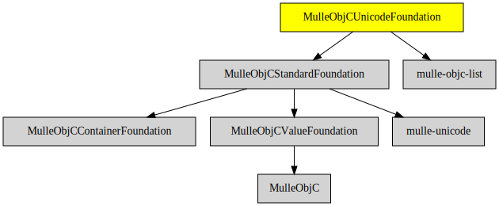

# MulleObjCUnicodeFoundation

#### 🤓 Unicode 3.x.x support for mulle-objc

This library does not add any classes, but provides a lot of categories
on NSString and NSCharacterSet.

| Release Version                                       | Release Notes
|-------------------------------------------------------|--------------
|  [](//github.com//MulleObjCUnicodeFoundation/actions)| [RELEASENOTES](RELEASENOTES.md) |


## Requirements

|   Requirement         | Release Version  | Description
|-----------------------|------------------|---------------
| [MulleObjCStandardFoundation](https://github.com/MulleFoundation/MulleObjCStandardFoundation) |  [](https://github.com///actions/workflows/mulle-sde-ci.yml) | 🚤 Objective-C classes based on the C standard library
| [mulle-unicode](https://github.com/mulle-c/mulle-unicode) |  [](https://github.com///actions/workflows/mulle-sde-ci.yml) | 🈚 Unicode ctype like library
| [mulle-objc-list](https://github.com/mulle-objc/mulle-objc-list) |  [](https://github.com///actions/workflows/mulle-sde-ci.yml) | 📒 Lists mulle-objc runtime information contained in executables.

### You are here



## Add

Use [mulle-sde](//github.com/mulle-sde) to add MulleObjCUnicodeFoundation to your project:

``` sh
mulle-sde add github:MulleFoundation/MulleObjCUnicodeFoundation
```

## Install

### Install with mulle-sde

Use [mulle-sde](//github.com/mulle-sde) to build and install MulleObjCUnicodeFoundation and all dependencies:

``` sh
mulle-sde install --prefix /usr/local \
   https://github.com/MulleFoundation/MulleObjCUnicodeFoundation/archive/latest.tar.gz
```

### Manual Installation

Install the requirements:

| Requirements                                 | Description
|----------------------------------------------|-----------------------
| [MulleObjCStandardFoundation](https://github.com/MulleFoundation/MulleObjCStandardFoundation)             | 🚤 Objective-C classes based on the C standard library
| [mulle-unicode](https://github.com/mulle-c/mulle-unicode)             | 🈚 Unicode ctype like library
| [mulle-objc-list](https://github.com/mulle-objc/mulle-objc-list)             | 📒 Lists mulle-objc runtime information contained in executables.

Install **MulleObjCUnicodeFoundation** into `/usr/local` with [cmake](https://cmake.org):

``` sh
cmake -B build \
      -DCMAKE_INSTALL_PREFIX=/usr/local \
      -DCMAKE_PREFIX_PATH=/usr/local \
      -DCMAKE_BUILD_TYPE=Release &&
cmake --build build --config Release &&
cmake --install build --config Release
```

## Author

[Nat!](https://mulle-kybernetik.com/weblog) for Mulle kybernetiK


